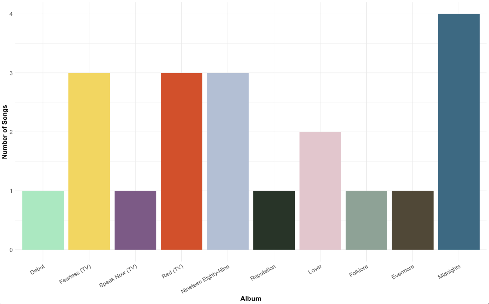
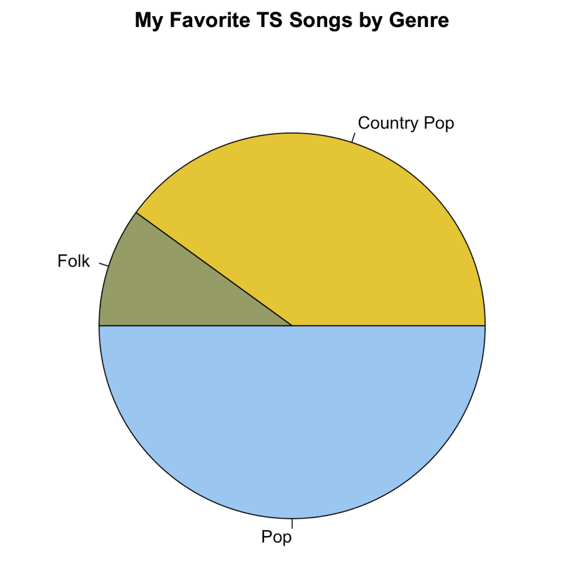
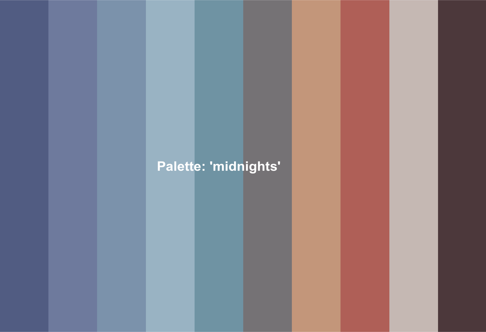
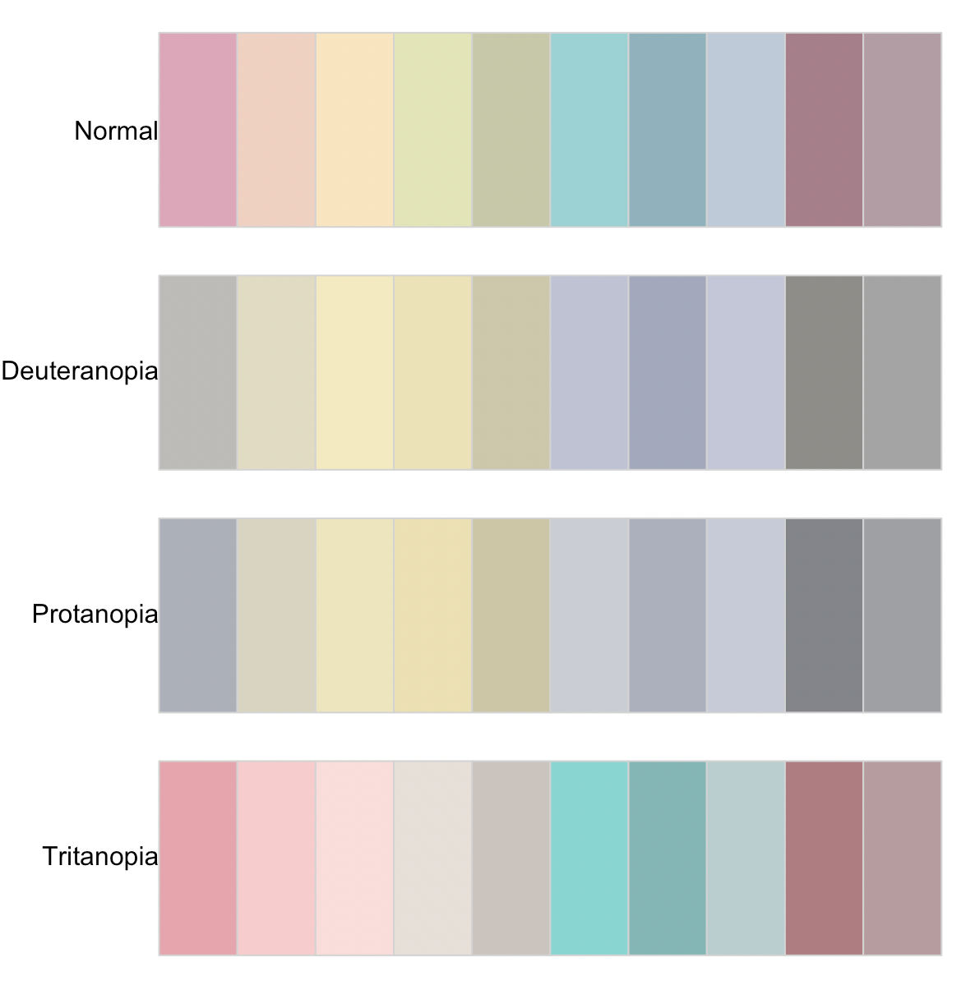

# `TayloRsVersion`: R Color Palettes, but Taylor's Version

## Description (It's me! Hi!)

This package contains color palettes for R data visualization that are inspired by Queen Taylor Swift's albums and eras. I am in no way associated with Taylor (but would love to be), I just stayed up way too late one night doing this because I'm the problem, it's me.


## Available Palettes (From lavender haze to burning red)

Below, here are all of the palettes currently available. These will be updated as Taylor's Versions become available.


## Installation (Are you ready for it?)

To install TayloRsVersion, run the following in your `R` console:

``` r
devtools::install_github("brchalifour/TayloRsVersion")
```

To list the names of all palettes available on TayloRsVersion, run the following in your `R` console:

``` r
list_tayloR_palettes()
```

## Examples (Look what you made me do)

This is a basic example which shows you how to use TayloRsVersion. For fun, let's use data on my personal top 20 favorite Taylor songs:

``` r
# Run once: 
devtools::install_github("brchalifour/TayloRsVersion")
library(TayloRsVersion)
library(ggplot2)

# Read in data
songs <- read.csv("https://raw.githubusercontent.com/brchalifour/TayloRsVersion/master/TS_data.csv")

# Count the number of songs per album
songs_count <- table(songs$Album)

songs_countdf <- as.data.frame(songs_count)

# Rename column 1 to "Album"
names(songs_countdf)[1] <- "Album"

# Create a bar graph of my favorite songs by album
ggplot(data = songs_countdf) + 
  geom_bar(aes(x = Album, y = Freq, fill = Album), stat = "identity") + 
  scale_fill_manual(values = tayloR_palette("fearless_TV2"), guide = "none") + 
  xlab("Album") + ylab("Number of Songs") + 
  theme_minimal() +
  theme(axis.text.x = element_text(size = 12, angle = 30, hjust = 1)) +
  theme(axis.text.y = element_text(size = 12)) +
  theme(axis.title.x = element_text(size = 14, face = "bold")) +
  theme(axis.title.y = element_text(size = 14, face = "bold")) 
```
This produces the following output, a Fearless bar plot of favorite songs by album:



Or, I can look at my favorite songs by album genre:

``` r
# Count the number of songs per genre
genre_count <- table(songs$Genre)

# Create a pie chart of my favorite songs by album genre:
pie(genre_count, main="My Favorite TS Songs by Genre", col = tayloR_palette("lover2"))
```
This produces the following output, a Loverly pie chart of favorite songs by genre:



## Other Functions

If I'm not sure what palette I want to use, I can view palettes this way:

``` r
show_tayloR_palette("midnights")
```
Which produces the following output:



In the spirit of inclusivity, I have added a function to show what palettes look like with different forms of colorblindness. For instance, I can run the following command:

``` r
test_colorblindness("lover")
```
Which produces the following output, showing how the Lover palette appears under varying forms of colorblindness.



## Long Story Short...

If you use TayloRsVersion, please let me know! I would love to see what you create. 

BONUS: Can you find the secret easter egg palette?

### Taylor, please notice me.


